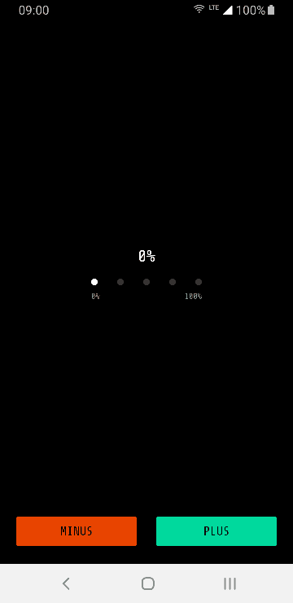
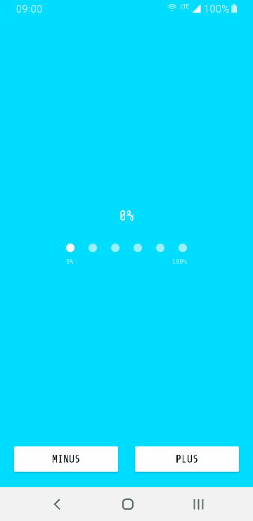

# progress-indicator-view
A custom Android view showing determinate progress through a stupid but funny animation.

There are a lot of cool animations for indeterminate progress bars, but there are not many ways to add a little fun to determinate progress bars. We needed a progress bar to show the download state of a [Dynamic Module](https://developer.android.com/studio/projects/dynamic-delivery). The designer working with me thought that the awesome Android 6 [boot animation](https://www.youtube.com/watch?v=8TGC6EmVXlU) shows the current progress of boot, and she asked me to replicate it. While that's not correct, I was intrigued by the idea and this is the result.
I did nothing more than extending romandanylyk's [PageIndicatorView](https://github.com/romandanylyk/PageIndicatorView), adding similar setters and getters to Android [ProgressBar](https://developer.android.com/reference/android/widget/ProgressBar), and implementing a [finite-state machine](https://en.wikipedia.org/wiki/Finite-state_machine) to manage the animation while progressing.




## Download &nbsp; [](https://jitpack.io/#eu.acolombo/progress-indicator-view)

Add the dependency in your app  `build.gradle` with the current version number: 

```gradle
implementation 'eu.acolombo:progress-indicator-view:0.3.5'
```

If you haven't done so already for other libraries, you also have to add JitPack in your root `build.gradle`:
```gradle
allprojects {
    repositories {
        ..
        maven { url 'https://jitpack.io' }
    }
}
```

This library is AndroidX only, if you are still using Support libraries you can either migrate your app to AndroidX or you can contribute by downgrading the dependencies and subitting a pull-request, which will be merged in a different branch.

## Customization

All [PageIndicatorView](https://github.com/romandanylyk/PageIndicatorView)'s attributes are still valid and can be used both through Java/Kotlin and through XML. I also added a few more similar to ProgressBar's ones and a few more which I'll explain/illustrate later.

    stopOnStep
    stepToMin
    skipSteps
    balanceForward

I also added three callbacks:

    onStepChanged
    onMinReached
    onMaxReached
