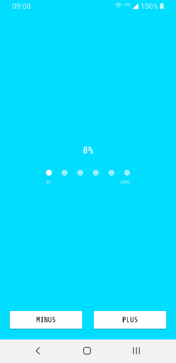

# progress-indicator-view
A custom Android view showing determinate progress through a fun/stupid animation.

There are a lot of cool animations for indeterminate progress bars, but there are not many ways to add a little fun to determinate progress bars. I did nothing more than extending [romandanylyk's PageIndicatorView](https://github.com/romandanylyk/PageIndicatorView), adding similar setters and getters to Android's [ProgressBar](https://developer.android.com/reference/android/widget/ProgressBar), and implementing a [finite-state machine](https://en.wikipedia.org/wiki/Finite-state_machine) to manage the animation while progressing.




## Download &nbsp; [](https://jitpack.io/#eu.acolombo/progress-indicator-view)

Add the dependency in your app  `build.gradle` with the current version number: 

```gradle
implementation 'eu.acolombo:progress-indicator-view:1.0.1'
```

If you haven't done so already for other libraries, you also have to add JitPack in your root `build.gradle`:
```gradle
allprojects {
    repositories {
        ..
        maven { url 'https://jitpack.io' }
    }
}
```

This library is AndroidX only, if you are still using Support libraries you can either migrate your app to AndroidX or you can contribute by downgrading the dependencies and subitting a pull-request, which will be merged in a different branch.

### Usage

See [PageIndicatorView](https://github.com/romandanylyk/PageIndicatorView)'s readme for visual configuration, all the `piv_` attributes attributes are still valid (I wouldn't attach this component to a ViewPager though) and in the sample below I used the most relevant ones to display progress.

```xml
<eu.acolombo.progressindicatorview.ProgressIndicatorView
    android:id="@+id/progressIndicatorView"
    android:layout_width="wrap_content"
    android:layout_height="wrap_content"
    app:piv_min="100"
    app:piv_max="100"
    app:piv_progress="0"
    app:piv_count="8"
    app:piv_radius="4dp"
    app:piv_padding="16dp"
    app:piv_animationDuration="200"
    app:piv_animationType="slide"
    app:piv_selectedColor="@color/colorPrimary"
    app:piv_unselectedColor="@color/colorPrimaryDark" />
```

There are also a few `ProgressIndicatorView` specific attributes. They can be accessed in XML under the same prefix, `piv_`, and in kotlin/java through their respective getters/setters. The first group of attributes replicate the `ProgressBar` ones, while the others are boolean flags defining the behavior of the component:

name             | format  | default | description
---------------- | ------- | ------- | ------------------
`min`            | integer | 0       | Same as `ProgressBar` `min`. Defines the minimum value.  
`max`            | integer | 100     | Same as `ProgressBar` `max`. Defines the maximum value.  
`progress`       | integer | 0       | Same as `ProgressBar` `max`. Defines the default progress value, between min and max.  
`stopOnStep`     | boolean | false   | When the `progress` is exactly between steps, the animation stops.
`stopOnStart`    | boolean | true    | When the `progress` is the same as the starting limit, the animation stops. This limit is `min` if `balanceForward` is true, `max` otherwise.
`stepToMin`      | boolean | false   | The animation always goes back to the first step instead of going back to the previous one.
`skipSteps`      | boolean | false   | If the `progress` is faster than the animation, the animation will catch up by skipping steps. *Use `setProgress(progress: Int, animate: Boolean)` if you want to skip the animation altogether.*
`balanceForward` | boolean | true    | Defines the direction of the animation when the `progress` is between the center steps (i.e. progress is 50 with a max of 100) and there's not a previous direction defined. *Affects `stopOnStart` as explained above.*

I also added three callbacks:

- **onStepChanged**
- **onMinReached**
- **onMaxReached**

I'm sorry for Java users since I didn't use the usual Listener interface to implement. I made it in a more functional way to be faster and cleaner to use in kotlin.

Their names are self explanatory and you can use them in two ways. If you want to use more than one, use the constructor for `ProgressIndicatorView.Listener`:
```kotlin
progressIndicatorView.listener = ProgressIndicatorView.Listener(
    onMaxReached = { Log.d(TAG, "max" ) },
    onStepChanged = { step, forward -> Log.d(TAG, "$step $forward" ) },
    onMinReached = { Log.d(TAG, "min" ) }
)
```
Otherwise just redefine one of them or each at a time:
```kotlin
progressIndicatorView.listener.onMaxReached = { Log.d(TAG, "max" ) }
```
<small>*I'd like to receive some feedbacks for this choice I made and how I decided to tackle it, so if you're reading this go check out the [implementation](https://github.com/acolombo25/progress-indicator-view/blob/master/progress-indicator-view/src/main/java/eu/acolombo/progressindicatorview/ProgressIndicatorView.kt#L16) and let me know what you think.*</small>
